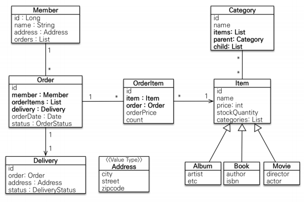

# Spring JPA 3
___

## 💿 Fetch Join & EAGER & LAZY

### 즉시 로딩(EARGR로 설정)

1. 멤버 전체를 조회하기 위해 JPQL 실행 select m from member m
2. JPQL은 EAGER와 무관하게 SQL로 그대로 번역 -> select m.* from member
3. JPQL 결과가 member만 조회하고, team은 조회하지 않음
4. member와 team이 즉시 로딩으로 설정되어 있기 때문에 연관된 팀을 각각 쿼리를 날려서 추가 조회 (N+1)

### 지연 로딩(LAZY로 설정)

1. 멤버 전체를 조회하기 위해 JPQL 실행 select m from member m
2. JPQL은 EAGER와 무관하게 SQL로 그대로 번역 -> select m.* from member
3. JPQL 결과가 member만 조회하고, team은 조회하지 않음
4. member와 team이 지연 로딩으로 설정되어 있기 때문에 가짜 프록시 객체를 넣어두고, 실제 회원은 팀은 조회하지 않음
5. 실제 team을 사용하는 시점에 쿼리를 날려서 각각 조회(N+1)

### fetch join 또는 엔티티 그래프(EAGER, LAZY 상관 없음)

1. 멤버와 팀을 한번에 조회하기 위해 JPQL+fetch join 실행 select m from member m join fetch m.team
2. JPQL에서 fetch join을 사용했으므로 SQL은 멤버와 팀을 한 쿼리로 조회 -> select m.*, t.* from member join team ...
3. JPQL 결과가 member와 team을 한꺼번에 조회함
4. member와 team이 fetch join으로 한번에 조회되었으므로 N+1 문제가 발생하지 않음

## 💿 Fetch Join 과 별칭

> JPA 표준 스펙에는 fetch join 대상에 별칭을 사용할 수 없다.

- 하지만 Hibernate는 허용
- 주의사항이 있음

### 주의 사항

1. fetch join JPQL에 on 조건을 달면 무조건 에러가 발생합니다.(with-clause not allowed on fetch association)
2. Select t from Team t join fetch t.member m on m.name=:memberName
   - member 컬렉션이 전부 조회되지 않기 때문에 실행 불가
   - 그러면 Select t from Team t join fetch t.member m on t.name=:teamName
   - 위의 것은 Member 컬렉션에 영향을 주지 않는데 왜 안될까?
3. 조인 과는 무관하게 Team 자체의 데이터를 필터링 하는 것이기 때문에 on 에 사용하는 것은 의도에 맞지 않다. where을 사용하는 것이 맞다.
4. select t from Team t join fetch t.members m where m.username = 'm1'
   - where을 사용하더라도 패치 조인 대상에는 where을 사용하면 안된다.
   - 실행 결과 team1 = teamA member = m1(member가 하나만 존재)

**따라서** fetch join의 결과는 연관된 모든 Entity가 있을거라고 가정하고 사용해야 함 이렇게 fetch join에 별칭을 잘못 사용해서 결과를 필터링 하면 객체의 상태와 DB의 상태 일관성이 깨짐

**결론:** fetch join의 대상은 on, where 등에서 필터링 조건으로 사용하면 안된다.

___

## 💿 Hibernate 허용 

> 일관성이 깨지지 않는 범위 내에서 허용

- ex) Select m from Member m join fetch  m.team t where t.name=:teamName
  - 조회된 회원은 db와 동일한 일관성을 유지한 팀의 결과를 가지고 있습니다.
- 하지만 이 쿼리를 left join fetch로 변경하면 일관성이 깨질 수 있습니다.

___

## 💿 Fetch Join의 한계

1. Fetch Join 대상에는 별칭을 줄 수 없다.
   - Hibernate 는 가능, 가급적 사용X(fetch join을 여러번 해야 할때 가끔 사용)
2. 둘 이상의 컬렉션은 페치 조인 할 수 없다.
3. 켈렉션을 Fetch Join하면 페이징 API(setFirstResult, setMaxResults)를 사용할 수 없다.
   - 1:1, N:1 같은 단일 값 연관 필드들은 페치 조인해도 Paging 가능
   - Hibernate는 경고 로그를 남기고 메모리에서 페이징(위험)
   - 예를 들어 페이지가 1이면 다대일에서 컬렉션을 조회하면 하나에 하나만 매치되어 DB와 일치되지 않는 문제가 발생
   - 페이징 대신 컬렉션에 @BatchSize를 설정해서 limit을 설정해 준다. 혹은 persistence.xml에서 글로벌 하게 설정(한번에 N+1 문제에서 limit을 정해줄 수 있다.)
   - Dto로 뽑아도 된다.
4. 다대일에서 컬렉션에 들어오는 것은 하나의 객체에 여러개의 Entity가 들어오는 것이 아니라 각 Entity에 연관된 Entity가 전부 하나씩 대응되어 들어온다.

__

## 💿 Fetch Join의 최적화

### Entity 직접 노출

- 절대 Entity를 직접 노출해서는 안된다.
- 